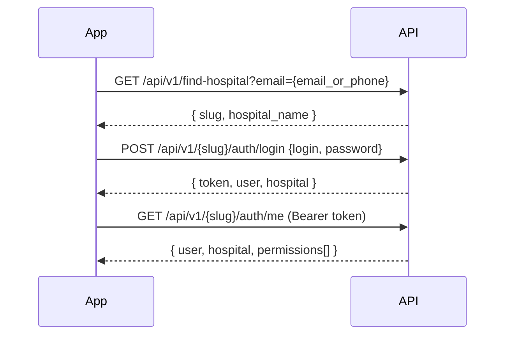

# Product Requirements Document (PRD)

## Eye SaaS HMS — Mobile Application (Full Web Parity)

**Document Version:** 1.0  
**Date:** June 26, 2026  
**Project:** `eye-saas-hms` (Laravel 13 multi-tenant ophthalmology HMS)  
**Scope:** Native/hybrid mobile app with **100% functional parity** to the existing web hospital application  
**Constraint:** No changes to the existing codebase in this phase — mobile consumes and extends the existing API layer

---

## 1. Executive Summary

**Eye SaaS HMS** is a multi-tenant SaaS platform for ophthalmology hospitals. The web app (`hmssaas.com/{slug}/...`) already supports:

- **OPD** — patient registration, billing, primary/secondary eye exams, prescriptions, FOC, clinical queue, reports
- **OT** — surgery booking through discharge (cataract/IOL workflow)
- **Admin** — masters, users, roles, settings, setup wizard
- **Platform** — hospital registration, subscriptions (Razorpay), super-admin panel
- **Cross-hospital** — partner hospital share history

A **mobile API layer** already exists at `/api/v1/{slug}/...` (Laravel Sanctum). OPD core flows are largely API-ready; **OT, FOC, masters CRUD, settings, printing, and admin flows are web-only or stubbed**.

This PRD defines a mobile app that replicates **every web feature**, role, permission, and workflow — using existing APIs where available and specifying new backend endpoints where gaps exist.

---

## 2. Product Vision & Goals

### 2.1 Vision

Give every hospital staff member (receptionist, doctor, OT team, admin) a **mobile-first workspace** that matches the web app — so clinical and operational work can happen at the desk, in the queue, in the OT ward, or on rounds without opening a browser.

### 2.2 Primary Goals

| Goal | Description |
|------|-------------|
| **Full parity** | Every web screen, action, validation rule, and permission gate exists on mobile |
| **Role-aware UX** | Navigation and dashboards adapt to the 7 system roles + custom roles |
| **API-first** | Mobile talks only to REST API; no direct DB access |
| **Tenant isolation** | Path-based multi-tenancy: all calls scoped to `{slug}` |
| **Clinical accuracy** | Eye exam JSON schema, dilation timers, queue logic must match web exactly |

### 2.3 Non-Goals (Platform — separate product)

- **Super Admin mobile app** — optional Phase 4; minimal API exists today (`/api/v1/super/tenants`)
- **Public landing/registration** — remains web-only unless explicitly scoped later
- **Patient-facing app** — staff app only; patients do not log in

---

## 3. System Context (Current Web Architecture)

### 3.1 Tech Stack (Backend — unchanged)

| Component | Technology |
|-----------|------------|
| Backend | PHP 8.3, Laravel 13 |
| Web auth | Session guard `hospital_user` |
| Mobile auth | Laravel Sanctum bearer tokens |
| Database | MySQL, 117 migrations |
| PDF | DomPDF |
| Excel | Maatwebsite Excel |
| Payments | Razorpay webhooks |
| Cache/Queue | Redis |

### 3.2 Multi-Tenancy Model

```
Platform (no slug)
  ├── /register, /login, /pricing
  └── /superadmin/*

Hospital Tenant (slug in path)
  ├── Web:  /{slug}/patients, /{slug}/exam/..., /{slug}/ot/...
  └── API:  /api/v1/{slug}/patients, /api/v1/{slug}/exams/...
```

- `IdentifyTenant` middleware resolves hospital from URL slug
- `BelongsToTenant` trait scopes all hospital models by `tenant_id`
- Subscription middleware blocks `inactive` / `suspended` tenants

### 3.3 API Response Contract (existing)

```json
{
  "success": true,
  "data": { },
  "message": "Human-readable message"
}
```

Errors: `success: false`, appropriate HTTP status (401, 403, 404, 422, 501).

---

## 4. User Personas & Roles

### 4.1 System Roles (seeded per tenant)

| Role | Slug | Super | Primary Mobile Use |
|------|------|-------|-------------------|
| Hospital Admin | `hospital_admin` | Yes | Dashboard, reports, users, roles, masters, settings, share history |
| Doctor | `doctor` | No | Clinical queue, primary/secondary exam, prescriptions, FOC create, history |
| Receptionist | `receptionist` | No | Register patients, check-in, bills, FOC accept, today's list |
| OT Receptionist | `ot_receptionist` | No | OT booking, counselling, package, payments list |
| Accountant | `accountant` | No | OT payments, invoices, exports, ward ready |
| OT Doctor | `ot_doctor` | No | Surgery recording, discharge, certificates |
| OT Assistant | `ot_assistant` | No | Ward entry, pre-op vitals, dilation, lens details |

**Custom roles** — Hospital Admin can create roles with granular permission checkboxes (`master.roles`).

### 4.2 Permission Model

- **60+ permission keys** across modules: `opd.*`, `ot.*`, `master.*`, `settings.*`, `reports.*`
- `is_super` role bypasses all checks
- Middleware: `permission:opd.patient.view` (pipe `|` = OR)
- Mobile must fetch user permissions at login (`/auth/me` + permissions endpoint — **new API needed**)

### 4.3 Authentication Flow (Mobile)



**Login fields:** email OR 10-digit phone (normalized)  
**Token:** Sanctum `personal_access_tokens`, name `mobile-token`  
**Missing today:** password reset API, permissions array in `/auth/me`, biometric unlock (client-only)

---

## 5. Feature Parity Matrix

| Module | Web | API Status | Mobile Priority |
|--------|-----|------------|-----------------|
| Auth (login/logout/me) | ✅ | ✅ Ready | P0 |
| Find hospital | ✅ | ✅ Ready | P0 |
| Password reset | ✅ | ❌ Missing | P1 |
| Dashboard (role-based) | ✅ | ⚠️ Admin only | P0 |
| Patient CRUD + check-in | ✅ | ✅ Ready | P0 |
| Phone appointment + history | ✅ | ✅ Partial | P0 |
| Clinical queue | ✅ | ✅ Ready | P0 |
| Primary exam | ✅ | ✅ Ready | P0 |
| Secondary exam | ✅ | ✅ Ready | P0 |
| Prescription print / HUD | ✅ | ❌ Missing | P1 |
| OPD bill PDF | ✅ | ❌ Missing | P1 |
| FOC | ✅ | ❌ Missing | P0 |
| Patient exam history | ✅ | ⚠️ Via reports/share | P0 |
| Reports + export | ✅ | ✅ Ready | P1 |
| Share history (cross-hospital) | ✅ | ✅ Ready | P2 |
| Medicine masters | ✅ | ✅ Ready (no perm middleware) | P2 |
| Eye exam masters (20+ types) | ✅ | ❌ Missing | P2 |
| Basic masters (cases, locations, etc.) | ✅ | ⚠️ Read + location create only | P2 |
| OT masters | ✅ | ❌ Missing | P2 |
| Users & roles | ✅ | ❌ Missing | P2 |
| Hospital settings | ✅ | ❌ Missing | P2 |
| Setup wizard | ✅ | ❌ Missing | P2 |
| Doctor profile (self) | ✅ | ❌ Missing | P1 |
| **OT full workflow** | ✅ | ❌ **Stub only** | P0 |
| Subscription banner / grace | ✅ | ⚠️ Partial in dashboard | P1 |

---

## 6. Mobile App — Information Architecture

### 6.1 Bottom Navigation (role-filtered)

| Tab | Visible To | Screens |
|-----|------------|---------|
| **Home** | All | Role-specific dashboard |
| **Patients** | OPD staff | Today's list, register, search, check-in |
| **Queue** | Doctors | Primary / Dilation / Secondary queues |
| **OT** | OT roles | Role-specific OT dashboards |
| **More** | All | Reports, FOC, masters, settings, profile, logout |

### 6.2 Role-Based Home Dashboards

**Hospital Admin**

- Subscription days remaining, trial/grace warning
- Today: patients, walk-in vs phone, primary/secondary queue counts
- Revenue: today / month / year
- OT: today's surgeries, operated, pending
- Primary queue preview (top 20)
- Receptionist performance (count, gross, FOC, net)
- Wait-time threshold indicators (green/orange/red)

**Doctor**

- Assigned patients today
- Primary / secondary pending counts
- Quick link to clinical queue (own doctor filter)
- Optional: switch doctor view (`view_doctor` query param parity)

**Receptionist**

- Today's registrations
- Phone patients awaiting check-in
- Pending FOC approvals
- Quick register (walk-in / phone)

**OT Receptionist / Accountant / OT Doctor / OT Assistant**

- Mirror web OT dashboards per role (see Section 8.2)

---

## 7. Detailed Functional Requirements

### 7.1 Authentication & Session

#### FR-AUTH-01: Hospital Discovery

- **Input:** Email or phone
- **API:** `GET /api/v1/find-hospital?email=`
- **Output:** `slug`, `hospital_name`
- **Error:** 404 if no active user found

#### FR-AUTH-02: Login

- **Input:** `login`, `password`
- **API:** `POST /api/v1/{slug}/auth/login`
- **Output:** Bearer token, user (id, name, email, contact, role, photo), hospital (name, slug)
- **Validation:** Same as web — active user, tenant match, subscription active

#### FR-AUTH-03: Session Persistence

- Store token securely (Keychain/Keystore)
- Auto-attach `Authorization: Bearer {token}` on all requests
- On 401: force re-login

#### FR-AUTH-04: Logout

- **API:** `POST /api/v1/{slug}/auth/logout`
- Revoke current token server-side; clear local storage

#### FR-AUTH-05: Current User

- **API:** `GET /api/v1/{slug}/auth/me`
- **Extend (new):** Include `permissions: string[]`, `subscription_status`, `grace_warning`, `is_setup_done`

#### FR-AUTH-06: Password Reset (NEW API)

- Parity with web: forgot password → email link → reset
- Endpoints needed:
  - `POST /api/v1/{slug}/auth/forgot-password`
  - `POST /api/v1/{slug}/auth/reset-password`

#### FR-AUTH-07: Permission Gating

- Every screen/action checks permission keys before render
- Super role (`is_super: true`) shows all features
- Denied actions: hide UI + block API calls with 403 handling

---

### 7.2 Dashboard

#### FR-DASH-01: Admin Dashboard

- **API:** `GET /api/v1/{slug}/admin/dashboard` (exists)
- Display all fields from `DashboardController::adminDashboard`:
  - `subscription_days_left`, `today_patients`, queue counts, revenue, OT stats, `primary_queue`, `receptionists`, `wait_thresholds`

#### FR-DASH-02: Role-Specific Dashboards (NEW APIs)

Web renders different dashboards per role in `DashboardController::index`. Mobile needs:

- `GET /api/v1/{slug}/dashboard/doctor`
- `GET /api/v1/{slug}/dashboard/receptionist`
- `GET /api/v1/{slug}/dashboard/ot-receptionist`
- `GET /api/v1/{slug}/dashboard/accountant`
- `GET /api/v1/{slug}/dashboard/ot-doctor`
- `GET /api/v1/{slug}/dashboard/ot-assistant`

Or single endpoint: `GET /api/v1/{slug}/dashboard` returning role-appropriate payload.

#### FR-DASH-03: Setup Wizard Redirect

- If `is_setup_done === false` and user is super admin → force setup wizard flow (Section 7.14)

#### FR-DASH-04: Subscription / Grace Banner

- Show days remaining, grace period warning (web `grace.check` middleware parity)

---

### 7.3 Patient Management (OPD)

#### FR-PAT-01: Today's Patient List

- **Permission:** `opd.patient.view`
- **API:** `GET /api/v1/{slug}/patients` (default: today; `?all=1` for all dates)
- **Features:** Search (MRD, name, contact), pagination (25/page), stats (total, waiting, primary_done, completed)
- **Display:** MRD (`patient_code`), doctor serial, name, age, gender, case type, exam status, dilation unlock timer (`unlock_time_ms`)

#### FR-PAT-02: Patient Detail

- **API:** `GET /api/v1/{slug}/patients/{id}`
- Relations: doctor, location, case type, referrer, primary/secondary exam summary

#### FR-PAT-03: Walk-in Registration

- **Permission:** `opd.patient.register`
- **API:** `POST /api/v1/{slug}/patients`

| Field | Validation |
|-------|------------|
| first_name, last_name | required, max 100 |
| middle_name | optional |
| age | 0–150 |
| gender | male, female, other |
| occupation | optional |
| contact_no | required, 10 digits |
| whatsapp_no | optional, 10 digits |
| location_id | required |
| appointment_date | required |
| slot_id | optional |
| doctor_id | required |
| case_id | required |
| case_fee | required, ≥ 0 |
| referrer_id | optional |
| is_old_patient | optional boolean |

- **Business rules:**
  - Auto-generate MRD (`patient_code`, e.g. `AEH0001`)
  - Auto-assign `doctor_patient_no` per doctor per day
  - Set `type = walkin`, `reception_id` = current user
  - Stamp `appointment_date`

#### FR-PAT-04: Phone Appointment Registration

- **Permission:** `opd.patient.register_phone`
- **API:** `POST /api/v1/{slug}/patients/phone`
- Same as walk-in **except** no `case_id` / `case_fee` at registration
- `type = phone`, no check-in until arrival

#### FR-PAT-05: Phone Patient History

- **Permission:** `opd.patient.register_phone`
- List past phone appointments for re-booking (NEW API or extend patients index with `type=phone` filter)

#### FR-PAT-06: Check-in (Phone Patients)

- **Permission:** `opd.patient.register`
- **API:** `POST /api/v1/{slug}/patients/{id}/checkin`
- **At check-in:** assign case type, case fee, doctor serial, `checked_in_at`
- Patient enters primary queue only after check-in

#### FR-PAT-07: Edit Patient (Pre-Exam Only)

- **Permission:** `opd.patient.edit`
- **API:** `PUT /api/v1/{slug}/patients/{id}`
- Block edit after `primary_done_at` (match web rules)

#### FR-PAT-08: Soft Delete

- **Permission:** `opd.patient.delete`
- **API:** `DELETE /api/v1/{slug}/patients/{id}`

#### FR-PAT-09: Search by Contact

- **API:** `GET /api/v1/{slug}/patients/search-by-contact?contact=`
- For duplicate detection at registration

#### FR-PAT-10: Next MRD Preview

- **API:** `GET /api/v1/{slug}/patients/next-mrd`
- Show next auto-generated code before save

#### FR-PAT-11: OPD Bill Print

- **Permission:** `opd.bill.print`
- **Web:** `GET /{slug}/patients/{id}/bill-pdf`
- **NEW API:** `GET /api/v1/{slug}/patients/{id}/bill-pdf` → PDF binary or signed URL
- Mobile: preview PDF, share, AirPrint

#### FR-PAT-12: Inline Master Creation

- Web allows AJAX add location from registration form
- **API exists:** `POST /api/v1/{slug}/masters/locations`

---

### 7.4 Clinical Queue

#### FR-QUEUE-01: Queue Dashboard

- **Permission:** `opd.exam.primary` OR `opd.exam.secondary`
- **API:** `GET /api/v1/{slug}/clinical-queue?date=&doctor_id=`
- **Three queues:**
  1. **Primary** — `primary_done_at` is null; phone patients only if `checked_in_at` set
  2. **Dilation** — primary done, `dilate=Yes`, timer not expired
  3. **Secondary** — primary done, (no dilation OR timer expired), `secondary_done_at` null

#### FR-QUEUE-02: Wait-Time Color Coding

- Thresholds from hospital settings / API defaults:
  - Primary (r): green ≤30, orange ≤60, red ≤120 min
  - Dilation (d): green ≤40, orange ≤90, red ≤120
  - Non-dilated secondary (nd): green ≤20, orange ≤60, red ≤120
- Visual: colored badges, elapsed time since registration / primary completion

#### FR-QUEUE-03: Dilation Countdown

- Use `unlock_time_ms` from API (epoch ms when secondary exam unlocks)
- Show live countdown; disable secondary exam entry until expired
- Match `ClinicalQueueApiController` logic exactly

#### FR-QUEUE-04: Doctor Filter

- Dropdown of doctors with `total_assigned`, `primary_pending`, `secondary_pending`
- Default: logged-in doctor if role is doctor

#### FR-QUEUE-05: Tap-to-Exam

- Primary queue item → Primary Exam screen
- Secondary queue item → Secondary Exam screen (if unlocked)

---

### 7.5 Eye Examination — Primary

#### FR-EXAM-P-01: Load Exam

- **Permission:** `opd.exam.primary`
- **API:** `GET /api/v1/{slug}/exams/primary/{patientId}`
- Returns exam with `exam_data` JSON + prescriptions

#### FR-EXAM-P-02: Save Exam

- **API:** `POST /api/v1/{slug}/exams/primary/{patientId}`

```json
{
  "doctor_id": 1,
  "dilation_time": 30,
  "exam_data": {
    "complaints": [],
    "co_rows": [{ "complaint", "since", "unit", "eye", "comment" }],
    "history": "string",
    "kco_rows": [{ "condition", "since", "unit", "comment" }],
    "kcos": [],
    "vision": {},
    "pg": {},
    "st": {},
    "nct": {},
    "oe": {},
    "fundus": {},
    "diagnoses": [],
    "followup_date": "date",
    "followup_duration": "string",
    "dilate": "Yes|No",
    "special_advice": "string",
    "advice": "string"
  },
  "medicines": [{
    "medicine_id", "name", "dosage_id", "duration", "quantity", "route_id"
  }]
}
```

#### FR-EXAM-P-03: Exam Sections (UI)

Mobile form must support all web sections with master dropdowns:

| Section | Master Tables |
|---------|---------------|
| Chief Complaints | `ChiefComplaint`, inline add |
| KCO (known conditions) | `Kco` |
| Vision (VN) | `MasterVn`, `MasterPnvn`, `MasterNrvn`, `MasterVngl`, `MasterVnst` |
| PG (refraction) | `MasterSphCyl`, `MasterAxis` |
| ST (slit lamp) | Various |
| NCT (tonometry) | `MasterNct` |
| OE (external exam) | `MasterLid`, `MasterConj`, `MasterCornea`, `MasterAc`, `MasterIris`, `MasterPupil`, `MasterLens`, `MasterSac`, `MasterFr`, `MasterEm`, `MasterCoverTest`, `MasterHno` |
| Fundus | `MasterDisc`, etc. |
| Diagnoses | `MasterDiagnosis`, inline add |
| Advice | `MasterAdvice`, inline add |
| Dilation | Yes/No + minutes (1–180) |

**NEW API needed:** `GET /api/v1/{slug}/masters/eye-exam/{type}` for all 20+ master types + inline create endpoints (parity with web AJAX: complaint, diagnosis, advice)

#### FR-EXAM-P-04: Prescriptions

- Search medicines (AJAX on web) → `GET /api/v1/{slug}/medicines` + search
- Apply medicine groups → `GET /api/v1/{slug}/medicine-groups/{id}`
- Fields: medicine, dosage, duration, quantity, route

#### FR-EXAM-P-05: Post-Save Behavior

- Set `primary_done_at` on patient
- If `dilate=Yes`: patient moves to dilation queue
- If `dilate=No`: patient moves to secondary queue immediately

#### FR-EXAM-P-06: Prescription Print / HUD View

- **Permission:** `opd.prescription.print`
- **Web:** print RX, compact HUD view
- **NEW API:** `GET /api/v1/{slug}/exams/primary/{patientId}/prescription-pdf`

---

### 7.6 Eye Examination — Secondary

#### FR-EXAM-S-01: Load / Save

- **Permission:** `opd.exam.secondary`
- **API:** `GET|POST /api/v1/{slug}/exams/secondary/{patientId}`
- Same `exam_data` + `medicines` structure as primary (via `StoreSecondaryExamRequest`)
- Block entry if dilation timer active (client + server validation)

#### FR-EXAM-S-02: Post-Save

- Set `secondary_done_at` → patient marked complete for the day

---

### 7.7 Patient Exam History

#### FR-HIST-01: Search History

- **Permission:** `opd.exam.history`
- Search by name, MRD, phone, date range
- **NEW API:** `GET /api/v1/{slug}/patient-history?search=&from=&to=`

#### FR-HIST-02: View Exam Detail

- Read-only view of primary + secondary exams per visit
- Prescription list per exam

#### FR-HIST-03: Print History

- **Web:** `GET /{slug}/patient-history/{patient}/print`
- **NEW API:** PDF download endpoint

#### FR-HIST-04: Patients by Phone (Disambiguation)

- **Web:** `ajax/patients-by-phone`
- **NEW API:** `GET /api/v1/{slug}/patients-by-phone?phone=`

#### FR-HIST-05: Doctor History / Hospital History

- Web dashboards: `doctor-history`, `hospital-history`
- Admin/doctor views of historical visits — **NEW API**

---

### 7.8 FOC (Free of Charge)

#### FR-FOC-01: FOC List

- **Permission:** `opd.foc.create` OR `opd.foc.accept`
- **NEW API:** `GET /api/v1/{slug}/foc`
- Filter: pending / accepted / rejected; today's date default

#### FR-FOC-02: Create FOC Request (Doctor)

- **Permission:** `opd.foc.create`
- **Fields:** patient_id, foc_fee (waived amount), reason
- **NEW API:** `POST /api/v1/{slug}/foc`
- Status: `pending`

#### FR-FOC-03: Accept FOC (Reception)

- **Permission:** `opd.foc.accept`
- **NEW API:** `POST /api/v1/{slug}/foc/{id}/accept`
- Sets `status=accepted`, `accepted_by`, `accepted_at`
- Deducts from receptionist net revenue on dashboard

#### FR-FOC-04: Reject FOC

- **NEW API:** `PATCH /api/v1/{slug}/foc/{id}/reject`
- Optional `rejected_reason`

#### FR-FOC-05: FOC Detail

- **NEW API:** `GET /api/v1/{slug}/foc/{id}`

---

### 7.9 Reports & Analytics

#### FR-RPT-01: Report List

- **Permission:** `reports.view`
- **API:** `GET /api/v1/{slug}/reports` (paginated, 25/page)
- Filters: date range, doctor, receptionist, location, case type, patient type
- Show `total_collection` for walk-in fees in filter

#### FR-RPT-02: Filter Dropdown Data

- **API:** `GET /api/v1/{slug}/reports/filter-data`

#### FR-RPT-03: Export Excel

- **Permission:** `reports.export`
- **API:** `GET /api/v1/{slug}/reports/export/excel`

#### FR-RPT-04: Export PDF

- **Permission:** `reports.export`
- **API:** `GET /api/v1/{slug}/reports/export/pdf`

---

### 7.10 Cross-Hospital Share History

#### FR-SHARE-01: Partner Connections

- **API:** `GET /api/v1/{slug}/share-history/connections`

#### FR-SHARE-02: Browse Hospitals

- **API:** `GET /api/v1/{slug}/share-history/hospitals`

#### FR-SHARE-03: Send / Accept / Remove Request

- `POST /api/v1/{slug}/share-history/requests`
- `POST /api/v1/{slug}/share-history/requests/{id}/accept`
- `DELETE /api/v1/{slug}/share-history/requests/{id}`

#### FR-SHARE-04: View Shared Patients

- `GET /api/v1/{slug}/share-history/patients`
- `GET /api/v1/{slug}/share-history/partner/{id}/patients`
- `GET /api/v1/{slug}/share-history/hospitals/{id}`

---

### 7.11 Medicine Masters

#### FR-MED-01: Medicines CRUD

- **Permission (web):** `master.medicines` — **fix API middleware**
- **API:** `GET|POST|PUT|DELETE /api/v1/{slug}/medicines`

#### FR-MED-02: Medicine Groups

- Full CRUD + `GET /medicine-groups/form-data`

#### FR-MED-03: Dosages, Types, Categories, Routes

- CRUD under `/medicine-dosages`, `/medicine-types`, `/medicine-categories`, `/medicine-routes`

#### FR-MED-04: Medicine Instructions

- **Web:** `medicine-instructions` CRUD
- **NEW API:** parity endpoints

---

### 7.12 Basic & Eye Exam Masters

#### FR-MASTER-01: Basic Masters

**Types:** cases, locations, referrers, durations, advices, instructions

| Action | Web | API Needed |
|--------|-----|------------|
| List | ✅ | `GET /masters/basic/{type}` |
| Create | ✅ | `POST /masters/basic/{type}` |
| Update | ✅ | `PUT /masters/basic/{type}/{id}` |
| Delete | ✅ | `DELETE /masters/basic/{type}/{id}` |
| AJAX inline create | ✅ | `POST /masters/basic/{type}/ajax` |

#### FR-MASTER-02: Eye Exam Detail Masters

**20+ types** from `DetailMasterController::modelMap()`:
complaints, kcos, diagnosis, advice, vn, vngl, vnst, pnvn, nrvn, sph_cyl, axis, nct, disc, fr, sac, lid, conj, cornea, ac, iris, pupil, lens, em, covertest, hno

| Action | API Needed |
|--------|------------|
| List | `GET /masters/detail/{type}` |
| Create | `POST /masters/detail/{type}` |
| Update | `PUT /masters/detail/{type}/{id}` |
| Delete | `DELETE /masters/detail/{type}/{id}` |
| Toggle favourite | `POST /masters/detail/{type}/{id}/toggle-favourite` |
| Sync by diagnosis | `POST /masters/detail/{type}/sync-by-diagnosis` |

#### FR-MASTER-03: OT Masters

**Types:** lens-options, slots, types, surgery-types, charge-heads

- Full CRUD APIs under `/masters/ot/{type}`

---

### 7.13 User & Role Management

#### FR-USER-01: User List / CRUD

- **Permission:** `master.doctors|master.receptions|master.ot_staff`
- **NEW API:** `/api/v1/{slug}/users` CRUD

#### FR-USER-02: Roles CRUD

- **Permission:** `master.roles`
- **NEW API:** `/api/v1/{slug}/roles` CRUD
- Permission grid: list all permissions grouped by module; set `is_granted` per permission

#### FR-USER-03: Role Permission Assignment

- Mirror `RoleController` checkbox grid
- Cache invalidation on save (60s cache in `RolePermissionService`)

---

### 7.14 Hospital Settings & Setup

#### FR-SET-01: Hospital Profile Settings

- **Permission:** `settings.hospital`
- **NEW API:** `GET|PUT /api/v1/{slug}/settings/hospital`
- Logo upload: multipart

#### FR-SET-02: Timezone

- **NEW API:** `GET|PUT|POST /api/v1/{slug}/settings/timezone`

#### FR-SET-03: Subscription Info (Read-Only)

- **Permission:** `settings.subscription`

#### FR-SET-04: Setup Wizard (First Admin Login)

| Step | Content | Skippable |
|------|---------|-----------|
| 1 | Hospital profile (name, logo, address) | Yes |
| 2 | Add first doctor | Yes |
| 3 | Add first receptionist | Yes |
| 4 | Add case types with fees | Yes |

- **NEW API:** `GET|POST /api/v1/{slug}/setup/{step}`, `POST .../skip`

#### FR-SET-05: Doctor Profile (Self)

- **NEW API:** `GET|PUT /api/v1/{slug}/profile`

---

### 7.15 OT Module (Full Workflow) — Critical Gap

Current API (`OtApiController`) returns **501 / empty stub**. Full implementation required.

#### OT Status Flow

```
booked → paid → in_ward → dilated → ready → operated → discharged
         (+ complicated, cancelled)
```

#### FR-OT-01: OT Dashboard (per role)

Mirror web dashboards for OT Receptionist, Accountant, OT Doctor, OT Assistant.

#### FR-OT-02: OT Booking List

- **Permission:** `ot.patient.list`
- **NEW API:** `GET /api/v1/{slug}/ot/bookings?date=&status=`

#### FR-OT-03: Create OT Booking

- **Permission:** `ot.booking.create`
- **NEW API:** `POST /api/v1/{slug}/ot/bookings`

| Field | Validation |
|-------|------------|
| patient_id | required, exists |
| surgery_date | required, ≥ today |
| slot_id | required |
| ot_doctor_id | required |
| eye | RE, LE, Both |
| ot_type_id | required |
| ot_surgery_type_id | required |
| mediclaim | boolean |
| lens_option | optional |
| package_amount | optional numeric |
| payment_mode | Cash, Online |
| report_ok | boolean |
| notes | optional, max 2000 |

#### FR-OT-04: Modify / Cancel Booking

- **Permissions:** `ot.booking.modify`, `ot.booking.cancel`

#### FR-OT-05: Counselling Form

- **Permission:** `ot.counselling.fill`
- **NEW API:** `GET|PUT /api/v1/{slug}/ot/bookings/{id}/counselling`

#### FR-OT-06: Record Payment (Accountant)

- **Permission:** `ot.payment.record`
- **NEW API:** `POST /api/v1/{slug}/ot/bookings/{id}/payments`
- Status: `booked` → `paid`

#### FR-OT-07: Ward Entry

- **Permission:** `ot.ward.entry`
- **NEW API:** `POST /api/v1/{slug}/ot/bookings/{id}/ward-entry`
- Status → `in_ward`

#### FR-OT-08: Pre-Op Vitals

- **Permission:** `ot.preop.entry`
- **NEW API:** `GET|POST /api/v1/{slug}/ot/bookings/{id}/preop`
- Fields: BP, RBS, temperature, HbA1c

#### FR-OT-09: Dilation Tracking

- **Permission:** `ot.dilation.track`
- **NEW API:** `GET|POST /api/v1/{slug}/ot/bookings/{id}/dilation`
- Status → `dilated`

#### FR-OT-10: Mark Ready for OT

- **Permission:** `ot.surgery.ready`
- **NEW API:** `POST /api/v1/{slug}/ot/bookings/{id}/ready`
- Status → `ready`

#### FR-OT-11: Record Surgery (OT Doctor)

- **Permission:** `ot.surgery.record`
- **NEW API:** `GET|POST /api/v1/{slug}/ot/bookings/{id}/surgery`
- Status → `operated`

#### FR-OT-12: Lens Details (OT Assistant)

- **Permission:** `ot.lens.record`, `ot.lens.implant`
- **NEW API:** `GET|POST /api/v1/{slug}/ot/bookings/{id}/lens`

#### FR-OT-13: Invoice & Billing

- **Permissions:** `ot.invoice.view`, `ot.invoice.edit`, `ot.billing.manage`
- Generate, edit line items, auto invoice number

#### FR-OT-14: Discharge

- **Permissions:** `ot.discharge.generate`, `ot.discharge.patient`
- Status → `discharged`

#### FR-OT-15: Print Documents (PDF)

- Invoice, discharge summary, summary bill, operation certificate, medicine slip

#### FR-OT-16: OT Payment Export

- **Permission:** `ot.payment.export`

#### FR-OT-17: OT Master Dropdowns

- **NEW API:** `GET /api/v1/{slug}/masters/ot/*`

---

## 8. Data Model Reference (Mobile-Relevant Entities)

### Patient (`patients`)

Key fields: `patient_code`, `doctor_patient_no`, names, age, gender, contacts, `location_id`, `appointment_date`, `doctor_id`, `case_id`, `case_fee`, `type` (walkin|phone), `checked_in_at`, `primary_done_at`, `secondary_done_at`, `is_old_patient`

### PrimaryExamination / SecondaryExamination

- `exam_data` (JSON), `dilation_time`, `examined_at`
- Related: `exam_prescriptions` → medicine, dosage, route, duration, quantity

### Foc (`focs`)

- `patient_id`, `doctor_id`, `foc_fee`, `status` (pending|accepted|rejected), `reason`

### OtBooking (`ot_bookings`)

- `surgery_date`, `slot_id`, `eye`, `ot_type`, `package_amount`, `ot_status`
- Related: `ot_counselling`, `ot_payments`, `ot_surgeries`, `ot_lens_details`, invoices

### HospitalUser (`hospital_users`)

Unified staff: doctors, receptionists, OT staff — linked to `roles`

### Tenant (`tenants`)

- `slug`, `name`, `status`, `trial_ends_at`, `is_setup_done`, `timezone`, `logo_path`

---

## 9. Non-Functional Requirements

### 9.1 Performance

| Requirement | Target |
|-------------|--------|
| API response (list endpoints) | < 2s on 4G |
| Patient list pagination | 25 items/page |
| Exam form save | < 3s |
| PDF generation | < 10s with loading indicator |

### 9.2 Offline / Connectivity

- **V1:** Online-only (match current API design)
- Show offline banner; queue failed writes locally — **V2 enhancement**

### 9.3 Platform Support

- **iOS:** 15+
- **Android:** API 26+ (Android 8)
- Recommended: **React Native** or **Flutter** for single codebase

### 9.4 Security

- Token in secure storage only
- Certificate pinning (recommended)
- Auto-logout after configurable idle timeout

### 9.5 Localization

- **V1:** English only
- Date/time in hospital timezone

---

## 10. Mobile UX Guidelines

### 10.1 Clinical Queue

- Sticky doctor filter at top
- Swipe between Primary / Dilation / Secondary tabs
- Pulsing timer on dilation cards
- Color-coded wait badges (green/orange/red)

### 10.2 Eye Exam Form

- Section accordion (collapse completed sections)
- Master pickers: searchable bottom sheet
- Inline add for complaint/diagnosis/advice
- Medicine row: search → dosage → duration → qty → route
- "Apply medicine group" one-tap

### 10.3 Patient Registration

- Step wizard: Demographics → Contact → Appointment → Case/Fee
- Contact lookup debounce (300ms) for duplicates
- Phone registration: hide case/fee until check-in

### 10.4 OT Workflow

- Kanban or status-stepper view per booking
- Role-specific action buttons only

### 10.5 PDF / Print

- In-app PDF viewer
- Share sheet (WhatsApp, email)

---

## 11. API Gap Summary (Backend Work for Mobile)

### Phase 0 — Already Available

- Auth, find-hospital, me, logout
- Patients full CRUD + check-in + search
- Exams primary/secondary
- Clinical queue
- Admin dashboard
- Masters read (cases, doctors, locations, slots, referrers) + location create
- Medicines full CRUD
- Reports + exports
- Share history full

### Phase 1 — P0 (Blockers for Launch)

| Endpoint Group | Est. Endpoints |
|----------------|----------------|
| FOC CRUD + accept/reject | 5 |
| OT full workflow | 25–30 |
| Role-based dashboards | 1–6 |
| Permissions in `/auth/me` | 1 |
| Patient history | 3 |
| OPD bill PDF | 1 |
| Prescription PDF | 1 |

### Phase 2 — P1 (Admin & Admin-Lite)

| Endpoint Group | Est. Endpoints |
|----------------|----------------|
| Password reset | 2 |
| Profile self-edit | 2 |
| Settings (hospital, timezone) | 4 |
| Setup wizard | 4 |
| Users CRUD | 5 |
| Roles CRUD + permissions | 6 |

### Phase 3 — P2 (Masters Parity)

| Endpoint Group | Est. Endpoints |
|----------------|----------------|
| Basic masters CRUD | 15 |
| Eye exam masters CRUD | 80+ |
| OT masters CRUD | 20 |
| Medicine instructions | 4 |
| Fix permission middleware on medicine APIs | — |

---

## 12. Phased Delivery Plan

### Phase 1 — MVP (8–10 weeks)

**Goal:** Daily OPD operations on mobile

- Auth + permissions
- Role dashboards (doctor, receptionist, admin)
- Patient register / check-in / list
- Clinical queue with dilation timers
- Primary + secondary exam (full form)
- FOC create + accept
- Basic PDF (bill, prescription)

**Roles covered:** Doctor, Receptionist, Hospital Admin (partial)

### Phase 2 — OT Module (6–8 weeks)

**Goal:** Full surgery day on mobile

- OT booking → discharge entire workflow
- All OT role dashboards
- OT document PDFs
- OT payment recording + export

### Phase 3 — Admin & Masters (6–8 weeks)

**Goal:** Hospital admin can run clinic from phone

- Users, roles, permissions
- All masters CRUD
- Settings, setup wizard
- Reports, share history

### Phase 4 — Polish (4 weeks)

- Password reset
- Push notifications (FOC pending, queue alerts, subscription expiry)
- App Store / Play Store release

---

## 13. Success Metrics

| Metric | Target (90 days post-launch) |
|--------|-------------------------------|
| Mobile DAU / Web DAU | ≥ 40% |
| OPD registration via mobile | ≥ 30% of walk-ins |
| Primary exam completed on mobile | ≥ 50% |
| OT booking → discharge on mobile | ≥ 25% |
| App crash rate | < 1% sessions |
| API error rate | < 0.5% |

---

## 14. Risks & Mitigations

| Risk | Impact | Mitigation |
|------|--------|------------|
| OT API not built | Blocks OT mobile entirely | Prioritize OT API in parallel with mobile Phase 2 UI |
| Eye exam form complexity | Long dev time, bugs | Reuse web validation schemas; shared API contract tests |
| 20+ master tables | Large API surface | Generic master API controller pattern |
| Dilation timer drift | Wrong queue placement | Use server `unlock_time_ms`; poll queue on focus |
| Permission mismatch web vs mobile | Security hole | Single `PermissionsSeeder` source; API middleware on ALL routes |

---

## 15. Testing Requirements

### 15.1 API Contract Tests

- PHPUnit feature tests for every new endpoint
- Match validation rules from existing Form Requests

### 15.2 Mobile E2E Scenarios

1. Receptionist: walk-in register → bill print
2. Receptionist: phone register → check-in → assign case
3. Doctor: primary exam with dilation → wait → secondary exam
4. Doctor: FOC request → Receptionist accept
5. OT full day: book → pay → ward → surgery → lens → discharge → print certificate
6. Admin: create user → assign role → verify permission on device
7. Share history: send request → partner accept → view cross-hospital exams
8. Subscription expired → login blocked with message

---

## 16. Appendix A — Complete Permission Keys

**OPD:** `opd.patient.register`, `register_phone`, `view`, `edit`, `delete`, `exam.primary`, `exam.secondary`, `exam.history`, `bill.print`, `prescription.print`, `foc.create`, `foc.accept`, `reports.view`, `reports.export`

**OT:** `ot.booking.create/modify/cancel`, `counselling.fill`, `patient.list`, `package.set`, `payment.record/export`, `ward.entry`, `preop.entry`, `dilation.track`, `surgery.ready/record`, `lens.record/implant`, `meds.takehome`, `invoice.view/edit`, `discharge.generate/patient`, `certificate.print`, `bill.print`

**Masters:** `master.case_types`, `doctors`, `receptions`, `ot_staff`, `roles`, `locations`, `medicines`, `eye_exam`, `ot_slots`, `ot_types`, `ot_charges`

**Settings:** `settings.hospital`, `settings.subscription`

**Reports:** `reports.view`, `reports.export`

---

## 17. Appendix B — Existing API Endpoint Catalog

```
GET    /api/health
GET    /api/v1/find-hospital
GET    /api/v1/super/tenants
GET    /api/v1/super/tenants/{id}

POST   /api/v1/{slug}/auth/login
POST   /api/v1/{slug}/auth/logout
GET    /api/v1/{slug}/auth/me

GET    /api/v1/{slug}/admin/dashboard

GET    /api/v1/{slug}/patients
GET    /api/v1/{slug}/patients/next-mrd
GET    /api/v1/{slug}/patients/search-by-contact
GET    /api/v1/{slug}/patients/{id}
POST   /api/v1/{slug}/patients
POST   /api/v1/{slug}/patients/phone
PUT    /api/v1/{slug}/patients/{id}
DELETE /api/v1/{slug}/patients/{id}
POST   /api/v1/{slug}/patients/{id}/checkin

GET    /api/v1/{slug}/masters/cases|doctors|locations|slots|referrers
POST   /api/v1/{slug}/masters/locations

GET    /api/v1/{slug}/exams/primary/{patientId}
POST   /api/v1/{slug}/exams/primary/{patientId}
GET    /api/v1/{slug}/exams/secondary/{patientId}
POST   /api/v1/{slug}/exams/secondary/{patientId}

GET    /api/v1/{slug}/clinical-queue

GET    /api/v1/{slug}/ot/bookings          [STUB]
POST   /api/v1/{slug}/ot/bookings          [501]
PUT    /api/v1/{slug}/ot/bookings/{id}/status [501]

GET|POST|PUT|DELETE  /api/v1/{slug}/medicines/*
GET|POST|PUT|DELETE  /api/v1/{slug}/medicine-groups/*
GET|POST|PUT|DELETE  /api/v1/{slug}/medicine-dosages|types|categories|routes/*

GET    /api/v1/{slug}/reports
GET    /api/v1/{slug}/reports/filter-data
GET    /api/v1/{slug}/reports/export/excel|pdf

GET|POST|DELETE  /api/v1/{slug}/share-history/*
```

---

## 18. Summary

The **eye-saas-hms** web application is a mature, feature-rich ophthalmology HMS with strong OPD API foundations. A mobile app achieving **full web parity** requires:

1. **Consuming ~40% of features from existing APIs** (OPD core, reports, medicines, share history)
2. **Building ~60% new API surface** (OT workflow, FOC, masters, settings, users, PDFs, history)
3. **Strict permission and tenant parity** with the web app
4. **Phased delivery** — OPD first, OT second, admin third

This document is the single source of truth for mobile app scope and backend API gaps.
